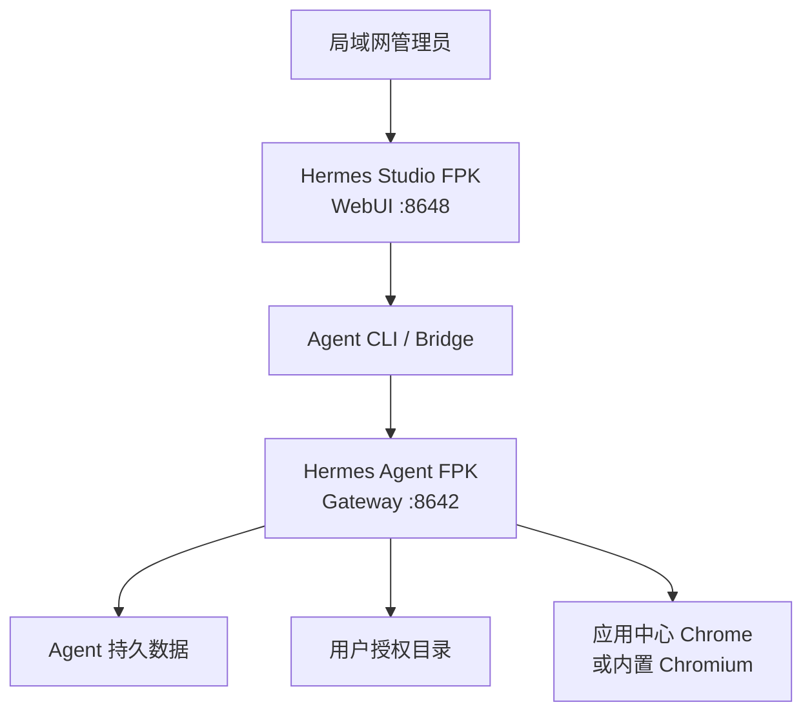

# Hermes Agent + Hermes Studio 双 FPK 开发文档

> 方案一：拆分为两个原生 fnOS 应用。Hermes Agent 负责运行时、后台服务和数据；Hermes Studio 保持上游 WebUI，通过官方环境变量、CLI 与 Bridge 接口管理和使用 Hermes Agent。

## 1. 文档状态

- 目标平台：fnOS 1.2 正式版
- CPU 架构：仅 `x86_64`
- 使用范围：个人、家庭局域网、单管理员
- 安装形态：两个 FPK，离线安装；运行依赖全部内置
- 数据策略：全新配置，不迁移现有 Docker 数据
- 上游策略：只跟踪正式 Release；每天北京时间 12:10 检查，按 Agent/Studio 独立构建和发布，用户手动安装升级
- 当前基线：Hermes Agent `v2026.8.19`，Hermes Studio `v0.6.47`
- 文档日期：2026-08-27

上游项目：

- [Hermes Agent](https://github.com/nousresearch/hermes-agent)
- [Hermes Studio](https://github.com/EKKOLearnAI/hermes-studio)
- [fnOS 应用开发资料](https://github.com/ckcoding/fnnas-docs)
- 目标开发仓库：[FNAMS](https://github.com/cmbya/FNAMS)

## 2. 目标与非目标

### 2.1 必须实现

1. `HermesAgent.fpk` 能在 fnOS 上独立安装、启动、停止、升级和卸载。
2. Agent 在浏览器关闭、Studio 停止后仍能在后台运行，继续执行定时任务并接收消息。
3. `HermesStudio.fpk` 以 Agent 为安装依赖，打开后可作为 Agent 的 WebUI。
4. Studio 中原有的聊天、会话、模型/API、Skills、记忆、MCP、定时任务、消息平台、文件、终端、浏览器、工作流等功能保持上游行为。
5. Agent 保留上游全部消息平台；微信按个人微信扫码登录能力保留，QQ 使用开放平台机器人，Telegram 等使用上游原生配置。
6. Agent 只访问用户在 fnOS 中授权的目录；默认工作目录在安装或首次配置时选择。
7. 危险终端命令继续经过 Hermes 原有确认机制；不得因打包绕过审批。
8. 优先控制 fnOS 应用中心安装的 Chrome；不可发现或不可控制时使用 Agent FPK 内置 Chromium。
9. 两个 FPK 都不在安装时下载 Python、Node、npm 包、Python 包或浏览器。
10. 上游正式 Release 发布后，只构建发生更新的项目；两个项目都更新时分别构建两个独立 FPK、校验和与构建清单。

### 2.2 明确不做

- 不把 Hermes Agent 与 Hermes Studio 再合并成一个超大 FPK。
- 不迁移现有 Docker 容器、数据库、配置或聊天记录。
- 不修改上游页面、删除菜单或重写业务功能。
- 不额外集成 Claude Code、Codex、Pi 等外部 Agent 运行时。
- 不提供公网访问、多人账户或多租户隔离。
- 不新增离线语音识别或语音合成依赖。

“不修改原有功能”是本方案的硬约束。允许的改动仅限 FPK 清单、启动脚本、路径适配、权限、环境变量、构建脚本和必要的兼容包装器。

## 3. 为什么拆成两个 FPK

原单包同时包含 Python、Node、Agent 依赖、Studio、Chromium 等内容，压缩后仍接近 600 MiB，并在 fnOS 安装阶段出现 tar 解压失败。没有设备端完整安装日志时，不能断言唯一原因；可能因素包括包体、文件数量、嵌套运行时、空间或 fnOS 解包限制。

拆包后的直接收益：

- 安装失败可以定位到 Agent 包或 Studio 包。
- Studio 升级不再重复解压 Python、Agent 依赖和 Chromium。
- Agent 后台生命周期不依赖 WebUI。
- 两个上游可以独立锁定版本和回滚。
- Studio 包会显著减小，Agent 包也不会再包含前端构建产物。

## 4. 总体架构



职责边界：

| 项目 | Hermes Agent FPK | Hermes Studio FPK |
|---|---|---|
| Python 与 Agent 依赖 | 内置并持有 | 不包含 |
| Node 与 Studio | 不包含 | 内置并持有 |
| Chromium 备用浏览器 | 内置 | 不包含 |
| 消息网关、机器人、Cron | 持续后台运行 | 仅配置和展示 |
| `HERMES_HOME` | 持有、读写 | 经授权读写同一份数据 |
| WebUI | 可选状态页，不复制 Studio | 上游完整 Studio |
| Agent CLI/Python | 导出稳定包装器 | 调用包装器 |
| 停止应用的影响 | 停止 Agent 服务 | 不停止 Agent 服务 |

## 5. 跨应用集成契约

这是两个 FPK 之间唯一允许依赖的稳定接口。Studio 不直接依赖 Agent 包内部的版本目录或源码目录。

### 5.1 Agent 导出的接口

Agent 安装后导出以下唯一命名的包装器：

| 稳定入口 | 用途 |
|---|---|
| `/usr/local/bin/hermes-fnos` | Hermes CLI |
| `/usr/local/bin/hermes-python-fnos` | Studio Bridge 使用的 Python 解释器 |
| `/usr/local/bin/hermes-uv-fnos` | 上游 Bridge 需要 uv 时使用 |
| `/var/apps/HermesAgent/share/data` | Agent 共享持久数据入口 |

包装器内部可以定位 `/var/apps/HermesAgent/target`，但 Studio 的脚本和配置不得直接引用 Agent `target` 内部路径。

### 5.2 Studio 使用的环境变量

Studio 启动时至少设置：

```bash
HERMES_HOME=/var/apps/HermesAgent/share/data
HERMES_BIN=/usr/local/bin/hermes-fnos
HERMES_AGENT_BRIDGE_PYTHON=/usr/local/bin/hermes-python-fnos
HERMES_AGENT_BRIDGE_UV=/usr/local/bin/hermes-uv-fnos
HERMES_GATEWAY_URL=http://127.0.0.1:8642
GATEWAY_URL=http://127.0.0.1:8642
HERMES_WEB_UI_DISABLE_GATEWAY_AUTOSTART=1
HERMES_WEB_UI_STOP_GATEWAYS_ON_SHUTDOWN=0
```

建议不设置 `HERMES_AGENT_ROOT`，优先让 Studio 通过 `HERMES_BIN` 和 Bridge Python 发现 Agent。只有上游当前版本验证确实要求源码根目录时，才由 Agent 额外导出稳定只读入口，并记录在集成契约中。

### 5.3 Gateway 所有权

- Agent FPK 是 Gateway 唯一所有者。
- Agent `cmd/main` 启动 Gateway，Agent `cmd/stop` 才能停止它。
- Studio 禁止自动创建第二个 Gateway。
- Studio 停止或升级时不得杀死 Gateway。
- 如果 Studio 上游版本无法在禁用自动启动时正常工作，才启用兼容模式：Studio 可检测并复用已存在 Gateway，但仍不得停止 Agent 所有的进程。

### 5.4 共享数据权限

首选方式：Agent 在 `config/resource` 中创建 `data-share`，并给予 `hermesstudio` 用户读写权限。

示意配置：

```json
{
  "data-share": {
    "shares": [
      {
        "name": "data",
        "permission": {
          "rw": ["hermesagent", "hermesstudio"],
          "ro": []
        }
      }
    ]
  }
}
```

fnOS 若不允许在 Studio 用户尚未创建时预设 ACL，则采用以下回退顺序：

1. 安装 Studio 后，由 Agent 的配置/升级脚本补充共享目录 ACL。
2. 创建专用共享组 `hermes`，两个应用用户加入该组，目录权限设为组读写。
3. 如果上述机制均受 fnOS 限制，安装向导要求先安装 Agent、再安装 Studio，然后执行一次 Agent“修复 Studio 权限”动作。

禁止为了省事让 Studio 或 Agent 以 root 常驻运行，也禁止把共享目录设为所有用户可写。

## 6. 目标仓库结构

在 FNAMS 中保留旧单包实现用于参考，新建双包结构：

```text
FNAMS/
├── apps/
│   ├── hermes-agent/
│   │   ├── manifest
│   │   ├── config/
│   │   │   ├── privilege
│   │   │   ├── resource
│   │   │   └── ui
│   │   ├── cmd/
│   │   │   ├── main
│   │   │   ├── stop
│   │   │   ├── status
│   │   │   ├── install
│   │   │   ├── upgrade
│   │   │   └── uninstall
│   │   ├── app/
│   │   │   ├── bin/
│   │   │   ├── runtime/
│   │   │   └── browser/
│   │   └── wizard/
│   └── hermes-studio/
│       ├── manifest
│       ├── config/
│       ├── cmd/
│       └── app/
│           ├── bin/
│           ├── node/
│           └── studio/
├── scripts/
│   ├── resolve-releases.sh
│   ├── build-agent-fpk.sh
│   ├── build-studio-fpk.sh
│   ├── validate-agent-fpk.sh
│   ├── validate-studio-fpk.sh
│   └── write-build-manifest.sh
├── tests/
│   ├── contract/
│   ├── static/
│   └── device/
├── versions.lock
└── .github/workflows/build-release.yml
```

旧 `fpk/` 单包目录先移动到 `legacy/single-fpk/` 或保留在原分支，不立即删除。确认双包可安装前，不做破坏性清理。

## 7. 分步骤开发计划

每一步都有明确产物和完成标准。未达到完成标准时，不进入依赖它的下一步。

### 步骤 0：建立安全开发基线

操作：

1. 在 FNAMS 当前状态创建标签或备份分支，例如 `single-fpk-last-known`。
2. 创建开发分支 `feature/split-agent-studio-fpk`。
3. 保存单包 GitHub Actions 成功构建记录、产物大小和 fnOS tar 解压失败截图/日志。
4. 记录设备剩余空间、安装临时目录空间和失败时刻；后续用于判断拆包是否解决问题。

完成标准：

- 可以随时回到单包源码状态。
- tar 失败已有可对比的最小证据，不只保留口头描述。

### 步骤 1：重构仓库但不改变现有构建

操作：

1. 创建 `apps/hermes-agent`、`apps/hermes-studio`、`tests` 目录。
2. 把通用 Release 解析逻辑保留在 `scripts/resolve-releases.sh`。
3. 将 `versions.lock` 扩展为双应用锁文件，至少保存版本、tag、commit 和集成契约版本。
4. 暂时保留原 `build-fpk.sh`，新增两个构建入口，不复用一个“万能打包函数”隐藏差异。

建议锁文件字段：

```dotenv
HERMES_AGENT_VERSION=0.20.5
HERMES_AGENT_TAG=v2026.8.19
HERMES_AGENT_COMMIT=fcbd1076a93841fa88855acce810e342a5b78101
HERMES_STUDIO_VERSION=0.6.47
HERMES_STUDIO_TAG=v0.6.47
HERMES_STUDIO_COMMIT=d7a6038e46cad3a4a2e26c74f78fcafae55a52d8
INTEGRATION_CONTRACT_VERSION=1
NODE_VERSION=24.6.0
PYTHON_VERSION=3.11
CHROMIUM_VERSION=152.0.7977.64
```

完成标准：

- 双包目录存在，锁文件可由脚本解析。
- 原单包构建没有被意外破坏。

### 步骤 2：创建 Hermes Agent FPK 骨架

操作：

1. 设置 `appname=HermesAgent`，应用用户/组使用 `hermesagent`。
2. 限制架构为 `x86_64`，设置最低 fnOS 版本为已验证的 1.2 正式版。
3. 在 `config/resource` 声明 `data-share`，用于 `HERMES_HOME`。
4. 保持 `disable_authorization_path=false`，让用户在 fnOS 中选择 Agent 可访问目录。
5. 配置安装、升级、卸载、主进程、停止、状态脚本占位。
6. 如提供 UI，只做状态、日志、授权目录和修复权限入口，不复制 Studio 功能。

完成标准：

- 不含 Agent 运行时的最小 FPK 可以被 fnOS 安装、启动、停止和卸载。
- 应用不是以 root 常驻运行。
- `TRIM_DATA_ACCESSIBLE_PATHS` 能在脚本中读取到用户授权目录。

### 步骤 3：构建并内置 Agent 运行时

操作：

1. 在 GitHub Actions 的 Linux x86_64 环境下载锁定的 Python 独立运行时和 uv。
2. 按上游正式 Release/commit 安装 Hermes Agent。
3. 安装上游需要的消息平台 extras；优先使用上游 `all` 或等价完整集合，避免漏掉 Telegram、Discord、Slack、Matrix、飞书、钉钉、企业微信、Teams 等适配器。
4. 清理 pip/uv/npm 缓存、测试缓存、源码 `.git`、无用 debug 文件，但不删除运行时动态库或功能资源。
5. 生成离线依赖清单与许可证清单。
6. 在无网络容器中运行 `hermes --help`、模块导入和 Gateway 启动冒烟测试。

注意：个人微信扫码登录和 QQ 开放平台机器人是否能工作，取决于上游当前 Release 是否原生提供对应适配器。打包层保持上游能力，不伪造“已支持”。若上游没有，后续应作为独立适配器项目，不在此阶段修改 Hermes 核心。

完成标准：

- 断网环境可运行 `hermes --help`。
- Agent 核心模块、消息平台依赖均能导入。
- 运行时不存在指向 Actions 临时目录的绝对路径。

### 步骤 4：实现 Agent 后台生命周期

操作：

1. `cmd/main` 设置 `HERMES_HOME`、授权工作目录、PATH、库路径和日志目录。
2. 启动前检查 8642 端口；已有本应用 Gateway 时复用，其他进程占用时明确报错。
3. 以 `hermesagent` 用户启动 `hermes gateway`，记录 PID 和进程组。
4. `cmd/status` 同时检查 PID、进程命令、端口和轻量健康接口，避免只看 pid 文件。
5. `cmd/stop` 先发送 TERM 并等待最多 30 秒，再仅清理已确认属于本应用的进程。
6. 日志写入 `TRIM_PKGVAR` 或应用共享数据目录，配置轮转，禁止无限增长。
7. 重启 fnOS 后验证 Gateway 自动恢复。

完成标准：

- 浏览器未打开时，机器人和定时任务仍运行。
- 停止 Studio 不影响 Gateway。
- 停止 Agent 能优雅退出，不误杀系统中其他 Python/Node 进程。

### 步骤 5：实现 Agent 的稳定导出接口

操作：

1. 创建 `hermes-fnos`、`hermes-python-fnos`、`hermes-uv-fnos` 三个包装器。
2. 通过 fnOS `usr-local-linker` 导出到 `/usr/local/bin`。
3. 每个包装器启动前验证 Agent FPK 已安装、目标可执行文件存在。
4. 包装器使用 `exec` 传递全部参数和退出码，不吞掉 stdout/stderr。
5. 创建合同测试，验证 Studio 用户可以执行三个入口。
6. 验证 Studio 用户可以读写 `/var/apps/HermesAgent/share/data`，但不能访问未授权 NAS 目录。

完成标准：

```bash
/usr/local/bin/hermes-fnos --help
/usr/local/bin/hermes-python-fnos --version
/usr/local/bin/hermes-uv-fnos --version
```

三条命令均成功，且从 Studio 应用用户身份执行也成功。

这是进入 Studio 开发前的强制停止点：没有稳定导出接口和跨用户写入验证，不开始打包 Studio。

### 步骤 6：集成浏览器能力

操作：

1. 启动时按可配置列表探测 fnOS 应用中心 Chrome 的可执行文件和远程调试能力。
2. 探测成功时记录“系统 Chrome”模式，不复制或修改 Chrome 应用目录。
3. 探测失败时使用 Agent FPK 内置 Chromium。
4. Chromium 用户数据、下载和临时目录放在 Agent 可写目录，不写入 FPK `target`。
5. 浏览器进程必须由 Agent 用户运行，并限制监听地址为本机或局域网配置要求。
6. 在 Studio 中执行一个实际浏览任务，验证打开页面、点击、下载和关闭。

完成标准：

- 至少内置 Chromium 模式完整可用。
- 系统 Chrome 不可用时自动回退并给出清晰日志。
- 升级 Agent 不丢失浏览器配置和用户数据。

### 步骤 7：创建 Hermes Studio FPK 骨架

操作：

1. 设置 `appname=HermesStudio`，应用用户/组使用 `hermesstudio`。
2. 在 manifest 中设置 `install_dep_apps=HermesAgent>最低兼容版本`。
3. WebUI 默认监听 8648，局域网访问；不要默认暴露到公网。
4. Studio 自己的数据库、日志和设置放入 `TRIM_PKGVAR`。
5. 安装脚本验证 Agent 共享目录和三个稳定包装器；失败时阻止启动并显示修复说明。

完成标准：

- fnOS 在缺少 Agent 时阻止或提示先安装 Agent。
- Studio 最小骨架可安装、打开和停止。
- 停止 Studio 后 Agent 仍处于健康状态。

### 步骤 8：构建并内置 Studio

操作：

1. 按锁定的 Studio 正式 Release/commit 构建上游前端和服务端。
2. 内置锁定的 Node x86_64 运行时。
3. 使用上游 lockfile 的确定性安装命令；构建后裁剪开发依赖，但不裁剪运行依赖。
4. 不修改上游页面、路由、菜单和功能判断。
5. 在断网环境启动 Studio 并访问健康接口和首页。

完成标准：

- Studio FPK 中不包含 Python、Agent site-packages 或 Chromium。
- 断网可打开上游 Studio 完整界面。
- 构建产物不引用 Actions 临时路径。

### 步骤 9：连接 Studio 与 Agent

操作：

1. Studio `cmd/main` 写入第 5.2 节环境变量。
2. 启动前执行合同检查：Agent 版本、共享目录读写、CLI、Bridge Python、Gateway 健康。
3. 使用上游 Studio 的 Runtime Discovery、CLI 和 Bridge，不新增私有 RPC 协议。
4. 对 `HERMES_HOME` 做并发读写测试，确认 Studio 与 Gateway 同时操作不会损坏配置。
5. Studio 关闭时只停止自身 Node/Bridge 子进程，不停止 Agent Gateway。
6. Agent 暂停、升级或故障时，Studio 显示“Agent 不可用”以及恢复建议，不无限重启。

完成标准：

- Studio 能新建会话并通过 Agent 完成一次聊天。
- Studio 能读取和修改模型/API、Skills、记忆、MCP、任务及消息平台配置。
- 关闭浏览器、停止 Studio 后，已配置消息平台仍能收发消息。

### 步骤 10：实现授权目录、文件和终端测试

操作：

1. Agent 首次安装或配置时，让用户选择一个默认授权目录。
2. 将所选路径写入应用配置，不假设卷名，也不硬编码 `/vol1`。
3. Hermes 工作区仅从 `TRIM_DATA_ACCESSIBLE_PATHS` 中选择。
4. 在 Studio 文件管理器中测试读取、创建、修改、上传和下载。
5. 测试终端普通命令和危险命令；危险命令必须出现确认流程。
6. 尝试访问未授权目录，预期失败并产生可理解日志。

完成标准：

- 授权目录完整可用。
- 未授权目录不可读写。
- 打包脚本没有放宽 Hermes 原有危险命令确认策略。

### 步骤 11：拆分构建流水线

构建入口支持按项目选择：

- `target=agent)：只编译 Hermes Agent。
- `target=studio)：只编译 Hermes Studio。
- `target=both`：在一次人工操作中依次执行两个独立构建，并生成两个独立 FPK/Release；它们不会共享包版本，也不会合并为一个 FPK。
- `agent_version` 与 `studio_version` 分开填写。留空时分别读取对应项目已有的正式 Release 版本并递增；手动输入优先。版本递增遵循 `0.1.8 → 0.1.9 → 0.2.0`，不生成 `0.1.10`。
- `Resolve the newest formal upstream Releases` 只解析被选中项目的最新正式上游 Release，不使用 prerelease、branch 或普通 commit。

每天北京时间 12:10（GitHub Actions 的 UTC `04:10`）由检查工作流分别查询 Hermes Agent 与 Hermes Studio。只有 Agent 更新时触发 Agent 构建，只有 Studio 更新时触发 Studio 构建，两个都更新时触发两个独立构建。并发控制只用于防止两个构建同时回写 `versions.lock`，不改变两个项目的独立产物和 Release。

GitHub Actions 每个目标的构建流程：

1. 解析该目标的正式上游 Release 和 commit。
2. 只下载并构建该目标需要的上游源代码和运行时。
3. 生成对应的 FPK，并执行解包、checksum、路径和运行时载荷校验。
4. 生成包含独立包版本、上游版本和集成契约版本的 `build-manifest.json`。
5. 只回写该目标在 `versions.lock` 中的包版本和上游锁定信息。
6. 发布目标专属 Release：`agent-vX.Y.Z` 或 `studio-vX.Y.Z`，并只上传对应 FPK。

完成标准：

- Agent 和 Studio 可分别手动编译、分别升级和分别回滚。
- 任一目标未被选择时，不下载、不编译、不发布该目标。
- 两个目标同时构建时，仍得到两个独立 FPK、两个独立版本号和两个独立 Release。
- 上游没有正式 Release 更新时，定时检查不触发构建。
- 构建失败时，不发布失败目标的 Release；真机验收仍按第 13 节执行。
### 步骤 12：执行静态与解包校验

对每个 FPK 分别检查：

- manifest、resource、privilege、ui JSON/配置语法。
- 所有 shell 脚本执行 `bash -n` 或对应 shell 语法检查。
- 包内无 FIFO、socket、设备文件、损坏符号链接和越界链接。
- ELF 均为 x86_64，动态库依赖可在包内或 fnOS 基础系统解析。
- 无写入只读 `target` 的运行逻辑。
- 无 `/home/runner`、构建容器路径、密钥和 token。
- FPK 可由标准 tar 工具完整列出并解包到临时目录。
- 记录每个包的压缩大小、解压大小、文件数、最长路径和最大单文件。

完成标准：

- 两个包的静态校验脚本全部通过。
- 在与 fnOS 安装流程等价的解包测试中没有 tar 错误。

### 步骤 13：fnOS 真机分阶段验收

必须按顺序执行：

1. 在干净测试环境只安装 Agent。
2. 重启 fnOS，验证 Agent 自动启动。
3. 配置一个模型、一个授权目录和至少一个消息平台。
4. 关闭所有浏览器，验证后台消息和任务。
5. 安装 Studio，验证依赖识别和首页。
6. 在 Studio 完成聊天、配置、Skills、记忆、MCP、文件、终端和浏览器测试。
7. 停止 Studio，验证 Agent 继续工作。
8. 启动 Studio，验证会话和配置仍在。
9. 分别升级 Studio、Agent；升级 Agent 时先停止 Studio，完成后再启动。
10. 模拟 Agent 不可用、端口占用、共享目录权限错误，验证错误提示与恢复步骤。

完成标准见第 10 节验收矩阵。任何一步再次出现 tar 解压失败，都要保留 fnOS 安装日志并只分析对应 FPK，不继续安装另一个包掩盖问题。

### 步骤 14：发布、升级与回滚

操作：

1. Release 附带安装说明、版本兼容表、SHA-256 和已知问题。
2. 正常升级顺序：先 Agent，后 Studio；升级前停止 Studio。
3. 升级脚本只迁移配置和数据，不在 `target` 保存持久数据。
4. 升级前为 `HERMES_HOME` 和 Studio 数据库创建带版本号备份。
5. 数据迁移成功后才写入新 schema 标记。
6. 回滚时分别安装上一版 FPK；如果上游迁移不可逆，先恢复对应备份。
7. 卸载 Studio 默认不删除 Agent 数据；卸载 Agent 时明确提示会影响 Studio，并让用户选择是否保留数据。

完成标准：

- 至少完成一次“旧版 → 新版 → 上一版”的真机演练。
- 回滚后 Agent 后台、Studio 登录和至少一个历史会话可用。

## 8. manifest 与运行配置要点

### 8.1 Agent manifest 核心项

```ini
appname=HermesAgent
arch=x86_64
display_name=Hermes Agent
version=<agent-package-version>
```

具体字段名和格式以 fnOS 1.2 的 manifest 规范及现有可安装示例为准，不复制未经验证的 DSM 字段。

### 8.2 Studio manifest 核心项

```ini
appname=HermesStudio
arch=x86_64
display_name=Hermes Studio
version=<studio-package-version>
install_dep_apps=HermesAgent><minimum-compatible-version>
```

如果 `>` 在 manifest 中有转义或版本格式要求，按 fnOS 文档和 `fnpack` 实测结果调整，不能只以文本校验代替安装验证。

### 8.3 端口

| 服务 | 默认端口 | 监听范围 | 所有者 |
|---|---:|---|---|
| Hermes Studio WebUI | 8648 | LAN/由 fnOS Web 配置决定 | Studio |
| Hermes Agent Gateway | 8642 | 默认 `127.0.0.1` | Agent |
| Browser debug | 动态或配置值 | 默认 `127.0.0.1` | Agent |

Gateway 只供本机 Studio 使用时必须绑定回环地址。消息平台的出站连接不要求把 Gateway 端口暴露到局域网。

## 9. 数据、权限与安全设计

| 数据 | 建议位置 | 升级保留 | Studio 权限 |
|---|---|---:|---|
| Agent 配置、会话、Skills、记忆、MCP | Agent `data-share` | 是 | 读写 |
| Agent 日志/PID | Agent `TRIM_PKGVAR` | 日志可轮转 | 默认无 |
| Studio 数据库和设置 | Studio `TRIM_PKGVAR` | 是 | 自有 |
| 授权工作区 | `TRIM_DATA_ACCESSIBLE_PATHS` | NAS 原数据 | 经 Agent 操作 |
| Chromium profile | Agent 持久目录 | 是 | 间接使用 |
| 临时 socket/cache | 各自 `TRIM_PKGTMP` | 否 | 各自 |

安全要求：

- API Key 只写入上游约定的私有配置；文件权限不得允许其他普通应用读取。
- 日志不得输出完整 API Key、Bot Token、Cookie 或扫码登录凭据。
- Studio 与 Agent 跨应用只共享必要数据目录和三个可执行入口。
- 包装器验证调用用户及目标路径，避免通过可写环境变量劫持解释器。
- FPK 校验和必须在安装前核对。
- LAN-only 不是身份认证替代品；保留 Studio 上游登录/管理保护。

## 10. 真机验收矩阵

| 编号 | 场景 | 预期结果 |
|---|---|---|
| A01 | 仅安装 Agent | 安装无 tar 错误，Gateway 健康 |
| A02 | fnOS 重启 | Agent 自动恢复，机器人继续工作 |
| A03 | 授权目录 | 可读写授权目录，拒绝未授权目录 |
| A04 | 消息平台 | 上游已支持的平台能配置并收发 |
| A05 | 定时任务 | 浏览器关闭后仍按时执行/投递 |
| A06 | 浏览器 | 系统 Chrome 可用则优先，否则回退 Chromium |
| S01 | 缺少 Agent 安装 Studio | 显示依赖提示，不进入故障循环 |
| S02 | Studio 启动 | 8648 可访问，首页和登录正常 |
| S03 | WebUI 聊天 | 创建会话、调用 Agent、流式输出正常 |
| S04 | 配置管理 | 模型/API、Skills、记忆、MCP 可读写 |
| S05 | 文件管理 | 仅授权工作区可操作 |
| S06 | 终端 | 普通命令运行，危险命令要求确认 |
| S07 | 停止 Studio | Agent Gateway、Bot、Cron 不停止 |
| S08 | Agent 故障 | Studio 明确显示不可用和恢复方法 |
| U01 | 只升级 Studio | Agent 数据和后台任务不受影响 |
| U02 | 先 Agent 后 Studio 升级 | 配置、会话、消息平台仍可用 |
| U03 | 回滚 | 恢复备份后两应用可启动 |
| T01 | 分包解压 | 两个 FPK 均可在 fnOS 安装器解压 |

## 11. 主要风险和回退方案

| 风险 | 影响 | 预防/回退 |
|---|---|---|
| fnOS 无法预授权尚未创建的 `hermesstudio` 用户 | Studio 不能写 Agent 数据 | 安装后补 ACL；专用共享组；提供“修复权限”动作 |
| Studio Bridge 必须使用具体 Python 路径 | Studio 无法启动 Bridge | Agent 导出 `hermes-python-fnos`；合同测试所有脚本参数和退出码 |
| Studio 与 Agent 同时启动 Gateway | 端口冲突、任务重复 | Agent 唯一拥有 Gateway；Studio 禁用 autostart 和 stop-on-shutdown |
| 两进程并发写 `HERMES_HOME` | 配置损坏 | 使用上游支持路径；并发测试；升级前备份；不自建旁路数据库 |
| Studio 新 Release 改变环境变量或 Bridge 行为 | 跨应用失效 | 每次 Release 先跑合同测试；锁定兼容组合；不自动发布未经真机验证版本 |
| 应用中心 Chrome 路径/权限变化 | 浏览器工具不可用 | 内置 Chromium 是强制保底；系统 Chrome 仅作可选优化 |
| Agent 单包仍然 tar 解压失败 | 无法安装 | 记录包大小/文件数/最长路径；进一步把 Chromium 做可选资源包或减少重复文件，但不在线下载 |
| 上游未原生支持个人微信或 QQ 开放平台 | 需求不能靠打包实现 | 在 UI 中如实呈现上游能力；另立适配器里程碑，不侵入双 FPK 基础架构 |
| 上游数据迁移不可逆 | 回滚失败 | 升级前快照；迁移版本标记；发布兼容表 |

## 12. 开发顺序和里程碑

### M1：Agent 可独立安装

包含步骤 0—4。交付 Agent FPK，验证 tar 解包、Gateway、重启和授权目录。

### M2：跨应用合同可用

包含步骤 5—6。交付三个稳定包装器、共享 ACL、浏览器回退和合同测试。

### M3：Studio 作为 WebUI 可用

包含步骤 7—10。交付 Studio FPK，完成聊天、配置、文件、终端及后台独立性测试。

### M4：可重复发布

包含步骤 11—14。交付 Actions、校验、真机验收记录、升级和回滚说明。

强制质量门：

1. M1 未通过，不开发 Studio FPK 的完整集成。
2. Agent CLI/Python/共享目录合同未通过，不声明 Studio 可管理 Agent。
3. “停止 Studio 后 Agent 继续运行”未通过，不发布第一版。
4. 两个包任一仍出现 tar 解压失败，不合并发布。
5. 未完成真机升级/回滚演练，不开启自动 Release 发布，只保留构建 artifact。

## 13. 第一轮实际开发任务清单

建议下一次编码严格只做以下任务，避免同时改动太多：

- [ ] 创建 `feature/split-agent-studio-fpk` 分支。
- [ ] 建立 `apps/hermes-agent` 最小 FPK 骨架。
- [ ] 从现有单包复制 Agent Python/依赖构建逻辑，删除 Studio/Node 内容。
- [ ] 从 Agent 包中保留 Chromium 备用运行时。
- [ ] 实现 Agent `main/stop/status`。
- [ ] 实现三个稳定包装器与 `usr-local-linker`。
- [ ] 打包 Agent，记录压缩大小、解压大小、文件数和最长路径。
- [ ] 在 fnOS 真机只安装 Agent，收集安装结果。
- [ ] 验证 Gateway、重启、授权目录和后台消息。

第一轮通过后再创建 Studio FPK。这样如果 tar 仍失败，问题范围只剩 Agent 包及 fnOS 安装环境，不会被 Studio 混淆。

## 14. 第一版完成定义

同时满足以下条件才算完成：

1. 两个 FPK 在 fnOS 1.2 x86_64 干净环境安装无 tar 错误。
2. Agent 可独立后台运行，重启后自动恢复。
3. Studio 使用上游支持的接口管理和使用同一个 Agent，不复制、不重写 Agent 功能。
4. Studio 停止或浏览器关闭后，机器人和定时任务继续运行。
5. 文件与终端只能在用户授权目录和权限范围内工作。
6. 危险命令确认、上游身份保护及密钥保护未被打包层绕过。
7. 浏览器至少通过内置 Chromium 可用，应用中心 Chrome 探测失败不会阻断功能。
8. 正式 Release 能自动构建两个离线 FPK，人工真机验收后可手动升级。
9. 完成一次升级和一次回滚演练，持久数据不丢失。
10. README 中包含安装顺序、配置步骤、故障排查、版本兼容表和已知限制。

---

本方案的核心不是重做 Hermes，而是把运行时所有权、后台生命周期、共享数据和稳定调用入口分清：Agent 是长期运行的服务，Studio 是可随时启停的管理界面。只要这四个边界保持稳定，后续两个上游分别升级时，维护成本会远低于单个超大 FPK。
